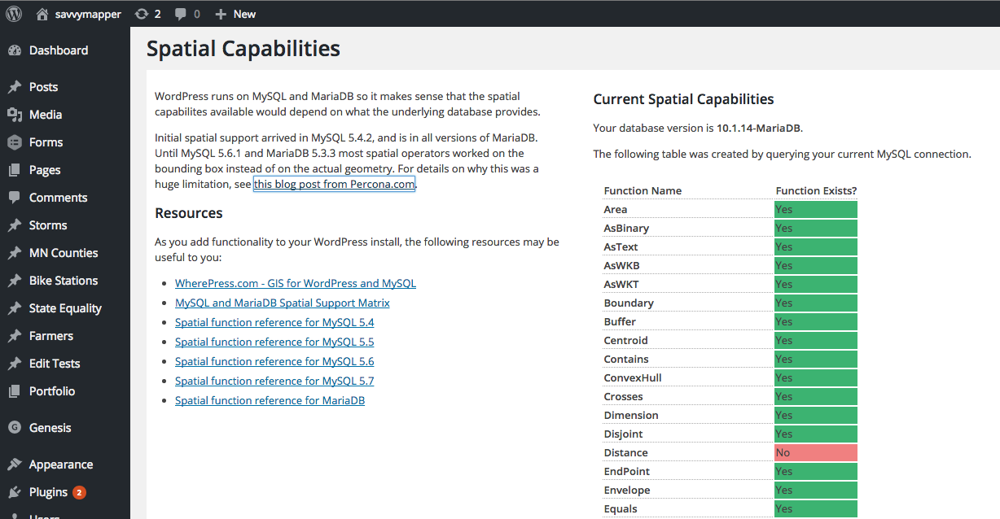
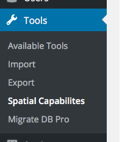

# WP Spatial Capabilities Check

Find out what spatial functions your WordPress database supports.

MySQL and MariaDB both have improved their spatial support in the last few years, but 
it's not always easy to track down which functions are available in which version.

This tool will check which functions are actually available in your current MySQL or MariaDB database.

## Instructions

Install this plugin, then go to your WordPress dashboard to Tools::Spatial Capabilities. It will
display a table with a list of all known spatial functions from MySQL and MariaDB along with a
simple 'Yes' or 'No', indicating if your install has that function.

## Screenshots

WP Spatial Capabilities Check shows an easy to read table listing spatial functions and if they're available with your current database.

The tool can be found in the Dashboard under Tools::Spatial Capabilities.

## More Spatial Help

For more information on how to use these functions see the following resources:

* [WherePress.com - GIS for WordPress and MySQL](http://wherepress.com/)
* [MySQL and MariaDB Spatial Support Matrix](https://mariadb.com/kb/en/mariadb/mysqlmariadb-spatial-support-matrix/)
* [Spatial function reference for MySQL 5.4](https://docs.oracle.com/cd/E19957-01/mysql-refman-5.4/functions.html#spatial-extensions)
* [Spatial function reference for MySQL 5.5](https://dev.mysql.com/doc/refman/5.5/en/spatial-function-reference.html)
* [Spatial function reference for MySQL 5.6](https://dev.mysql.com/doc/refman/5.6/en/spatial-function-reference.html)
* [Spatial function reference for MySQL 5.7](https://dev.mysql.com/doc/refman/5.7/en/spatial-function-reference.html)
* [Spatial function reference for MariaDB](https://mariadb.com/kb/en/mariadb/gis-functionality/)

## Version History

###  0.0.2

 * Internationalization
 * WordPress coding standards compliance

### 0.0.1

 * Initial development and testing
